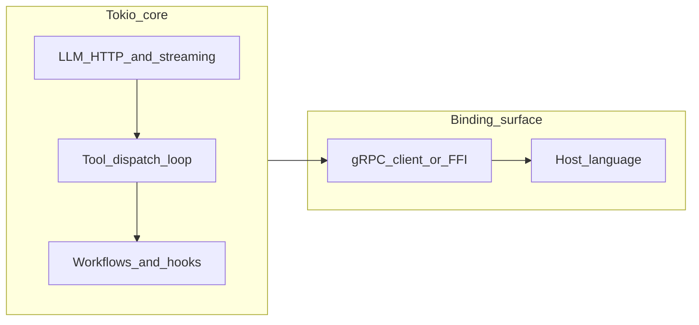

# Architecture

## Summary

The **Rust core** owns network I/O to LLM providers, streaming (including SSE) handling, retries and rate limiting, batch scheduling, the **tool dispatch loop**, and workflow and hook orchestration. **Language bindings** register tools, supply configuration, and surface results and telemetry to the host in an idiomatic way.

This separation matches patterns used by other polyglot native cores (for example dataframes and high-performance parsers): behavior is centralized; language layers are adapters.

## Responsibilities

### Rust core

- HTTP client stack, connection behavior, timeouts, and middleware (often `tower`-shaped when using stacks that compose with gRPC).
- Parsing and normalization of provider responses, including streaming chunks.
- Retry policies, backoff, and rate limits (API quotas versus local concurrency limits may be distinct concerns).
- Construction of chat-style message lists and tool call structures expected by providers.
- Execution of the tool loop: decide when to call a tool, serialize arguments, await host callback results, feed results into the next model call.
- Workflow engine and hook dispatch when those features are enabled, using internal representations (see [Protobuf, gRPC, and workflows](04-protobuf-grpc-and-workflows.md)).
- Unified error taxonomy and cancellation propagation (see [Tool boundary and async](03-tool-boundary-and-async.md)).

### Language bindings

- **Tool registration UX**: idiomatic registration of functions or methods; generation of JSON Schema from types and docstrings where the language supports it (Python), or hand-written schemas elsewhere.
- **Bridging async**: schedule host async callbacks without reimplementing orchestration (Python asyncio to Tokio bridge, JavaScript promises, and so on).
- **Configuration sugar**: constructors and kwargs-style APIs that map to core configuration.
- **Telemetry export**: forward `tracing` or OTLP-derived signals into host loggers or agents.

Bindings **do not** own the retry or tool-loop state machine if the deployment uses the full Rust core.

## High-level diagram

## Interaction surfaces

Two complementary ideas appear in the design discussion:

1. **In-process FFI** (for example PyO3): lowest latency for local embedding; more complexity for async and object lifetimes.
2. **gRPC** (often alongside protobuf types): bindings become thin clients; the core runs as a local daemon or sidecar. See [Protobuf, gRPC, and workflows](04-protobuf-grpc-and-workflows.md).

These are **deployment modes**, not competing philosophies. The same core logic can support both if the internal APIs are factored cleanly.

## Relation to existing Python GlueLLM

Behavioral parity is a **product goal**, not line-by-line porting. When in doubt, defer to [`../../gluellm/`](../../gluellm/) for semantics and document intentional differences in release notes when the Rust core ships.
