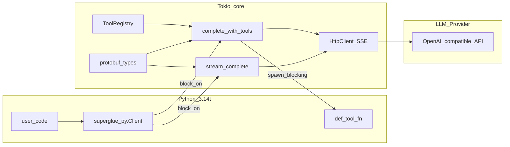

# Architecture

## Summary

The **Rust core** owns network I/O to LLM providers, SSE streaming, optional realtime voice sessions, retries and rate limiting, the tool dispatch loop, and (planned) workflow and hook orchestration. **Language bindings** register tools, supply configuration, and surface results and telemetry to the host in an idiomatic way.

## Implemented module map

```
superglue/                      — Rust library crate
├── src/
│   ├── http/
│   │   ├── client.rs           — HttpClient: GET, POST JSON, streaming POST (SSE)
│   │   ├── retry.rs            — RetryPolicy (GET: all retryable; POST: transport + 429/5xx)
│   │   ├── rate_limit.rs       — governor token-bucket rate limiter
│   │   ├── download.rs         — throttled file download (governor bandwidth limiter)
│   │   ├── sse.rs              — SseParser: incremental SSE framing
│   │   ├── url.rs              — join_base_url helper
│   │   └── error.rs            — unified HTTP error taxonomy
│   ├── realtime/               — optional duplex voice WebSocket sessions
│   │   ├── session.rs          — VoiceSession and VoiceConfig
│   │   ├── events.rs           — normalized audio, transcript, and tool events
│   │   └── xai.rs              — xAI Speech to Speech adapter
│   ├── openai/
│   │   └── mod.rs              — Full OpenAI chat completion types (request + response + streaming)
│   ├── chat/
│   │   └── mod.rs              — complete_with_tools (parallel tool dispatch), stream_complete, ChatOptions, CompletionOutcome
│   ├── client/
│   │   └── mod.rs              — Client + ClientBuilder: high-level API (complete, stream, batch, tools, hooks, agents)
│   ├── tools/
│   │   ├── registry.rs         — ToolRegistry: register + dispatch; ToolRetryPolicy store
│   │   ├── types.rs            — ToolSpec, ToolInvocation, OnToolError, ToolRetryPolicy
│   │   ├── harness.rs          — offline scripted tool execution plans
│   │   └── error.rs            — ToolInvokeError
│   ├── telemetry/
│   │   ├── mod.rs              — init_tracing, TelemetryConfig, OTLP wiring (otlp feature)
│   │   ├── scrub.rs            — ScrubFields, ScrubMode (Redact/Hash/Allow)
│   │   └── metrics.rs          — metric name constants, init_metrics (prometheus feature)
│   ├── audit/
│   │   └── mod.rs              — RunStore (in-memory), RunRecorder (HookHandler)
│   ├── grpc/
│   │   └── mod.rs              — tonic gRPC service (grpc feature): Complete + Stream RPCs
│   ├── cancel.rs               — re-export of tokio_util::sync::CancellationToken
│   ├── proto.rs                — includes prost/tonic-generated types from proto/superglue.proto
│   └── lib.rs                  — public re-exports + version()

superglue-py/                   — Python extension crate (PyO3, maturin)
├── src/lib.rs                  — Client, CompletionOutcome, StreamOutcome pyclass impls
└── examples/                   — 14 example scripts (01_simple_completion … 14_streaming_vs_buffered)
```

## Responsibilities

### Rust core — what is implemented

| Module | Responsibility |
|--------|---------------|
| `http::HttpClient` | `reqwest` wrapper; GET with full retries, POST JSON with POST-safe retries, streaming POST returning a byte stream |
| `http::RetryPolicy` | Configurable max retries and exponential backoff; GET retries all retryable statuses; POST retries only transport errors + 429/502/503/504 |
| `http::rate_limit` | Per-second quota via `governor`; optional, applied before every request |
| `http::download_throttled` | Bandwidth-limited file download using a `governor` token bucket; optional progress callback |
| `http::SseParser` | Incremental buffer-based SSE parser; handles split chunks, comments, multi-line data |
| `openai` | Full `ChatCompletionRequest` (all OpenAI params), `ChatCompletionResponse`, `ChatMessage` with multipart content, `ChatCompletionChunk` for streaming, `Usage`, `ToolCall`, `ToolChoice`, `ResponseFormat`, `StopSequence`, etc. |
| `chat::complete_with_tools` | Multi-turn tool loop: sends POST, dispatches all tool calls in a round **concurrently** (`join_all`), applies per-tool error policies, checks cancellation token, appends results, repeats until text response or `max_tool_rounds` |
| `chat::stream_complete` | Single-turn streaming: POST with `stream:true`, parses SSE chunks, calls `on_delta(token)` for each content delta, returns `StreamOutcome` |
| `realtime::VoiceSession` (`realtime` feature) | Duplex WebSocket voice session with binary audio, normalized transcripts, interruptions, and function-call events |
| `tools::ToolRegistry` | Async `Arc<dyn Tool>` store; concurrent-safe registration, dispatch by name, per-tool `ToolRetryPolicy` |
| `tools::OnToolError` / `ToolRetryPolicy` | Per-tool error handling: `FailFast` (default), `Skip` (append error as tool message), `Retry` (exponential back-off) |
| `tools::harness` | Deterministic offline test harness: execute a scripted plan of tool invocations without a live model |
| `cancel::CancellationToken` | Re-export of `tokio_util::sync::CancellationToken`; wired into `ChatOptions` and `BatchConfig` |
| `telemetry::init_tracing` | Installs `tracing_subscriber::fmt` layer with configurable `ScrubMode`; optionally adds OTLP layer (`otlp` feature) |
| `telemetry::ScrubMode` | `Redact` (default), `Hash` (correlation-safe), `Allow` (dev only) |
| `telemetry::metrics` | `metrics` facade counters and histograms for completions, tool calls, batches, HTTP retries |
| `audit::RunStore` / `RunRecorder` | In-memory bounded store for `proto::RunRecord`; `HookHandler` that captures pipeline events |
| `grpc` (`grpc` feature) | `tonic`-based gRPC server exposing `Complete` (unary) and `Stream` (server-streaming) RPCs |
| `proto` | `prost`/`tonic`-generated types from `proto/superglue.proto`; covers `ChatOptions`, `ChatMessage`, `Usage`, `ToolSpec`, `CompletionOutcome`, `HookEvent`, `RunRecord`, `StreamChunk` |
| `client::Client` | Bundles `HttpClient`, `ChatOptions`, `ToolRegistry`, `HookRegistry`, `GuardrailRegistry`; `complete`, `stream`, `batch`, `run_agent`, guardrail helpers |

### Language bindings — Python (`superglue-py`)

| Feature | Implementation |
|---------|---------------|
| `Client(api_key, model, …)` | `PyClient` wraps `ChatOptions` + `ToolRegistry` + `HttpClient` |
| `client.register_tool(name, description, parameters, fn)` | Wraps a Python `def fn(args: dict) -> dict` as a `PythonDictTool`; converts via `json.loads`/`json.dumps` |
| `client.complete(message)` | Calls `complete_with_tools` via `block_on`; tool callbacks delivered via `spawn_blocking + Python::attach` |
| `client.stream(message, on_token)` | Calls `stream_complete` via `block_on`; tokens delivered via `mpsc` channel + `spawn_blocking` consumer |
| GIL handling | `#[cfg(Py_GIL_DISABLED)]` for CPython 3.14t (no GIL); `PyEval_SaveThread/RestoreThread` for classic GIL Python |
| `CompletionOutcome` | `.content`, `.rounds`, `.usage` |
| `StreamOutcome` | `.content`, `.finish_reason`, `.usage` |

### Native Rust (`superglue`)

| Feature | Implementation |
|---------|---------------|
| `Client::builder()` / `Client::from_env()` | Same bundled state as `PyClient` / napi `Client` |
| `client.complete(message)` | Delegates to `chat::complete_with_tools` |
| `client.stream(message, on_delta)` | Delegates to `chat::stream_complete` |
| `client.batch(requests, config)` | Delegates to `batch::batch_complete` |
| `client.run_agent(spec, message)` | Delegates to `agents::AgentEngine` |
| Examples | Numbered `01`–`24` + `demo` in `examples/` using `Client` |

## High-level diagram



## Interaction surfaces

| Mode | Status | Notes |
|------|--------|-------|
| **In-process FFI (PyO3)** | ✅ shipped | `superglue-py`; targets CPython 3.14t free-threaded |
| **gRPC / tonic** | ✅ shipped | `--features grpc`; `Complete` + `Stream` RPCs; `serve` CLI subcommand |
| **napi-rs (Node.js)** | 🔲 planned | Same Rust core, different binding layer |

## Token delivery in streaming

Token delivery from the Rust async loop to a Python callback requires care because `Python::attach` must not be called from Tokio's async polling context (segfault on free-threaded CPython). The implemented solution:

1. `stream_complete` calls `on_delta: FnMut(String)` synchronously for each token.
2. In the Python binding, `on_delta` sends to a `tokio::sync::mpsc::unbounded_channel`.
3. A `spawn_blocking` consumer reads from the channel and calls `Python::attach` safely on a dedicated OS thread.
4. `block_on` waits for both the stream and the consumer to finish before returning to Python.

## Responses API, model fallback, and MCP

- **Chat Completions** (`/v1/chat/completions`): default path via `Client::complete` / `stream` and `chat::complete_with_tools`.
- **Responses API** (`/v1/responses`): `Client::complete_response` and `Client::stream_response`; tool rounds thread state with `previous_response_id` instead of replaying full message history (`responses` module).
- **Model fallback**: `ModelFallbackChain` on `ChatOptions` / `ClientBuilder::model_fallback_chain`; after HTTP retries on one model, eligible errors advance to the next model in the chain (`fallback` module).
- **MCP tools** (`--features mcp`): `Client::connect_mcp_stdio` / `connect_mcp_http` register remote MCP tools into the same `ToolRegistry` as local tools (`mcp` module, `rmcp` SDK).
