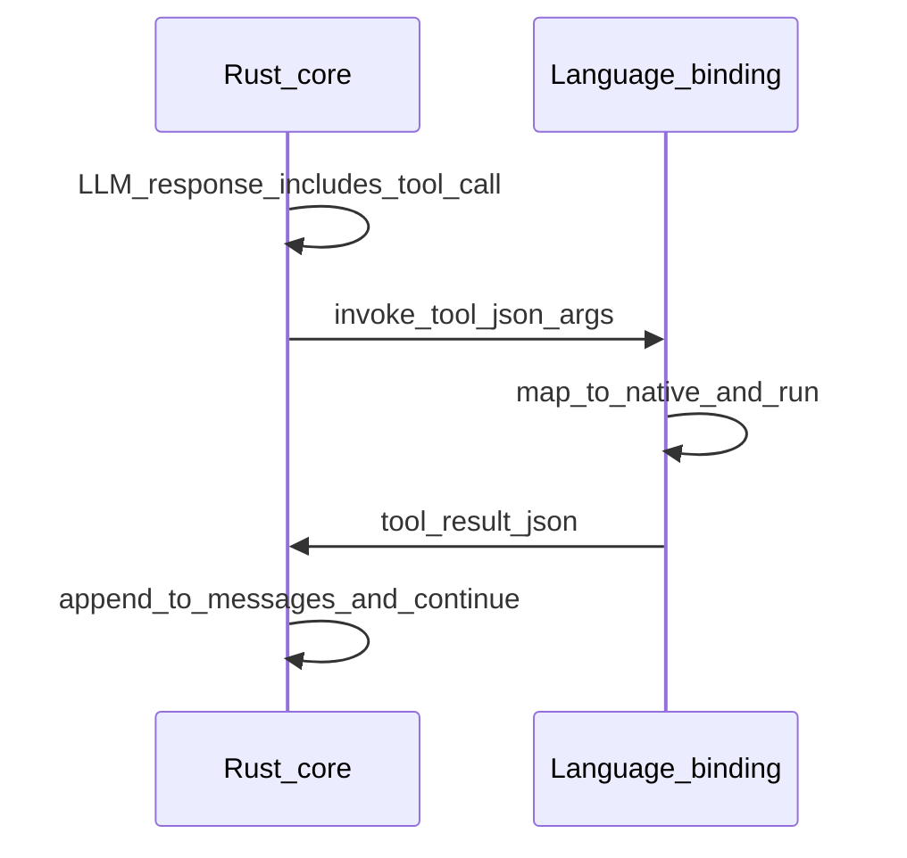

# Protobuf, gRPC, and workflows

## Why protobuf internally

Workflows, hooks, and internal events are richer than ad hoc JSON blobs. A **canonical binary schema** helps with:

- Stable, versioned contracts between components.
- Efficient serialization for high-volume event streams.
- Generated types in multiple languages when bindings consume the same definitions.

**Decided direction (from design discussion)**: treat **protobuf** as the internal source of truth for workflow state, hook payloads, tool invocation records, and related envelopes. Use **`prost`** (and typically `prost-build` in `build.rs`) for Rust. If gRPC services are exposed, **`tonic`** pairs naturally with `prost`.

JSON remains appropriate for **tool arguments and results** at the host boundary (see [Tool boundary and async](03-tool-boundary-and-async.md)). Mixing concerns is acceptable: protobuf for orchestration metadata, JSON for opaque tool payloads.

## gRPC from day one

**Decided direction (from design discussion)**: ship **gRPC** as a first-class interface. Benefits include:

- Streaming RPCs align with LLM streaming and event delivery.
- Language clients can be generated from the same `.proto` files.
- Operational tooling (`grpcurl`, custom CLIs) can talk to a running core without bespoke FFI.

`tonic` builds on **Tower**, which matches the earlier note that retry, timeout, and rate-limit middleware can share conceptual models with HTTP client stacks.

## Deployment modes

The design conversation considered two binding styles; they are **complementary deployment options**, not a single mandated approach.

| Mode | Pros | Cons |
|------|------|------|
| **gRPC client binding** | No FFI complexity; easy polyglot; clear process boundary | Extra latency; requires managing a daemon or sidecar |
| **In-process FFI** (PyO3, napi-rs, and so on) | Lower overhead; simpler single-process UX | Async bridging, object lifetimes, and debugging are harder |

**Open decision**: which mode is default for each language and how to package the daemon (if any) for desktop versus server.

## Optional sequence: tool round-trip

At a high level, the tool loop can be viewed as:

Internal event buses may wrap these steps in protobuf messages for logging, hooks, or persistence. The exact message types are **not specified here**.

## Workflows and hooks

Hooks and workflow transitions should be representable in the same protobuf model so that:

- A run can be **serialized** for resume or audit (subject to security policy).
- **Replay** and debugging can operate on recorded protobuf streams where allowed.

Persistence is a **policy** matter: see [Security and threat model](06-security-and-threat-model.md) for “minimal disk footprint” versus ordinary logging.

## See also

- [Observability](05-observability.md) for exporting traces that span gRPC and tool calls.
- [Roadmap and phasing](09-roadmap-and-phasing.md) for when to land proto and gRPC relative to the HTTP streaming MVP.
